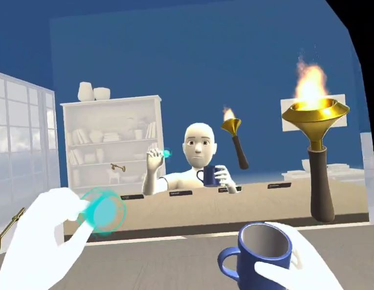

# Avatar Integration Samples

The Avatar Integration sample project contains sample scenes demonstrating the integration of Meta's Avatars with the Meta XR Interaction SDK. These samples provide practical examples of creating custom hand poses and object interactions.

## Licenses
The *Oculus Integration* package is released under the *[Oculus SDK License Agreement](https://developer.oculus.com/licenses/oculussdk)*.
The MIT licence applies to the files and assets in the Assets/Project folder.
Otherwise, if an individual file does not indicate which license it is subject to, then the Oculus License applies.

## Getting started

Clone this repo using the "Code" button above, or this command:
```sh
git clone https://github.com/oculus-samples/Unity-MetaXRInteractionSDK-AvatarSample.git
```

To run the sample, open the project in *Unity 2022.3.11f1* or newer and load the [Assets/Scenes/AvatarGrabExamples](Assets/Scenes/AvatarGrabExamples.unity) or [Assets/Scenes/AvatarPokeExamples](Assets/Scenes/AvatarPokeExamples.unity) scenes.

## Interactions

The project contains two sample scenes that showcase different interactions implemented with the Interaction SDK and integrated with Avatars.
AvatarGrabExamples - Demonstrates "Hand Grab" interactions with Avatars.
AvatarPokeExamples - Demonstrates "Poke" interactions with Avatars.

For more information please reference the *[Interaction SDK documentation](https://developer.oculus.com/documentation/unity/unity-isdk-interaction-sdk-overview/)* and the *[Avatars SDK documentation](https://developer.oculus.com/documentation/unity/meta-avatars-overview/)*
